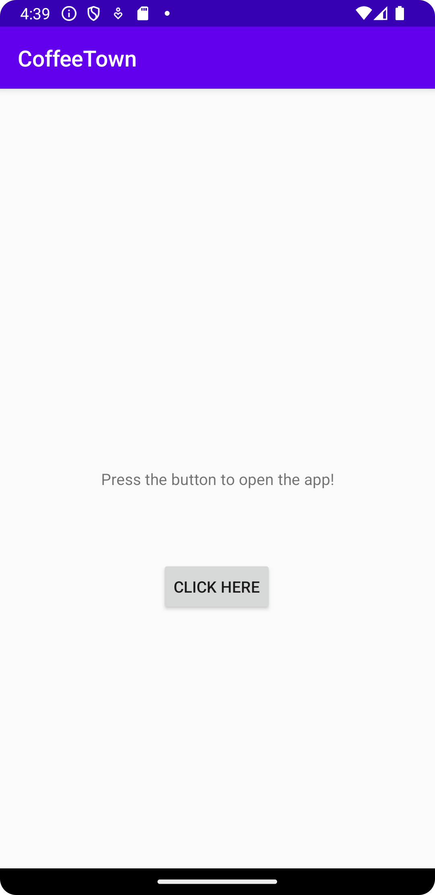
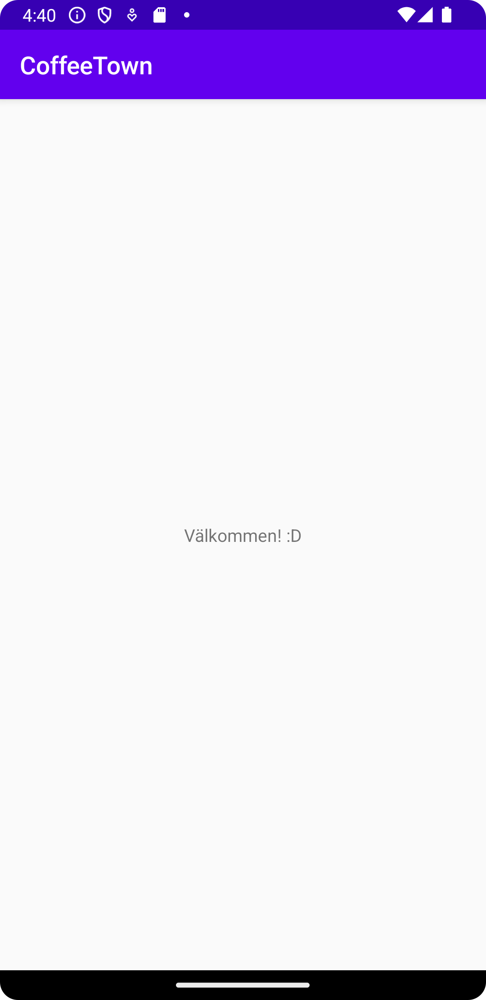

# Rapport
I uppgift 4 har activities och intents för att få fram två olika sidor med hjälp av en button. 
Det första som behövdes göras var att skapa en ny activity, det gjordes enkelt genom att skapa en tom activity fil.
Sedan behövdes knappen läggas till i första sidans xml fil. Detta gjordes på detta sätt:

```
 <Button
        android:id="@+id/button"
        android:layout_width="wrap_content"
        android:layout_height="wrap_content"
        android:text="Click here"
        app:layout_constraintBottom_toBottomOf="parent"
        app:layout_constraintHorizontal_bias="0.498"
        app:layout_constraintLeft_toLeftOf="parent"
        app:layout_constraintRight_toRightOf="parent"
        app:layout_constraintTop_toBottomOf="@id/text"
        app:layout_constraintVertical_bias="0.217" />
```
Nu har vi en knapp som finns på första sidan, men just nu går den ej att klicka på, så detta måsta fixas på följande sätt.
Det är även här vi skapar intents för att kunna skapa en onclick så när man trycker på knappen kommer man tas till sida 2.


```
Button b = findViewById(R.id.button);

        b.setOnClickListener(new View.OnClickListener() {
            @Override
            public void onClick(View view) {
                Log.d("==>","Lets go!");
                Intent intent = new Intent(MainActivity.this, MainActivity2.class);
                intent.putExtra("name", "Välkommen! :D"); // Optional
                intent.putExtra("number", 55); // Optional
                startActivity(intent);
            }
        });
```
Detta läggs då in i OnCreate i första sidans java fil. Nu kan man trycka på knappen och tas till andra sidan.
Det sista som nu har gjorts är att datan som finns i intentsen skall visas som en textview på andra sidan. Det första måste göras i xml sidan för andra sidan och ser ut så här:


```
<TextView
        android:layout_width="wrap_content"
        android:layout_height="wrap_content"
        android:id="@id/text"
        app:layout_constraintBottom_toBottomOf="parent"
        app:layout_constraintLeft_toLeftOf="parent"
        app:layout_constraintRight_toRightOf="parent"
        app:layout_constraintTop_toTopOf="parent"
        />
```
Detta är då bara en vanlig textview som har ett id, men för att bundle datan ska visas i texten bör det också skivas kod i java filen för andra sidan.

```
protected void onCreate(Bundle savedInstanceState) {
        super.onCreate(savedInstanceState);
        setContentView(R.layout.activity_main2);
        TextView textView = findViewById(R.id.text);

        Bundle extras = getIntent().getExtras();
        if (extras != null) {
            String name = extras.getString("name");
            int number = extras.getInt("number");
            textView.setText(name);
        }
    }
```
Nu har vi en färdig app, där man på första sidan kan trycka på en knapp som tar en till andra sidan. 
Där det där i en textview visar upp data från bundles i intenten. 





